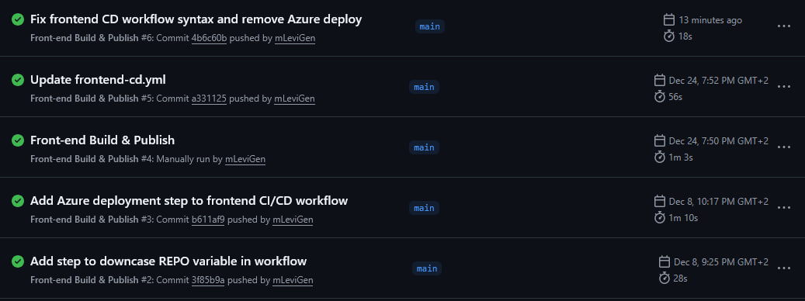
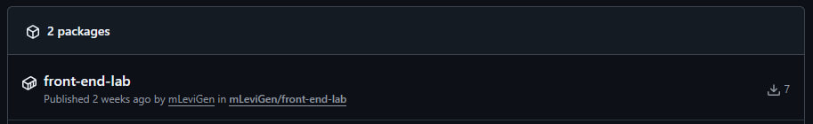

# Лабораторна робота №10

### Тема: Неперервна інтеграція 
### Мета: ознайомитися з принципами і практиками неперервної інтеграції, сформувати навички автоматизації CI/CD процесів в GitHub Actions

## Демонстрація роботи
### Виконані гітхаб курси:
- [Hello GitHub Actions](https://github.com/mLeviGen/kpz-skills1)
- [Publish Packages](https://github.com/mLeviGen/kpz-skills2)

### Actions

### Workflow
)

### Створений пакет:

## Висновки
Під час лабораторної роботи було ознайомлено з принципами неперервної інтеграції та розглянуто можливості GitHub Actions для автоматизації CI/CD. Було виконано практичні роботи GitHub Skills «Hello GitHub Actions» і «Publish Packages», що дозволило закріпити базові навички створення та запуску workflows. Також було розроблено власний workflow для front-end репозиторію з двома тригерами. У результаті підтверджено коректну роботу workflow у GitHub Actions та відображення опублікованого Docker-образу у вкладці Packages.
